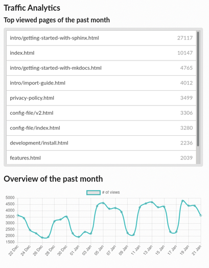
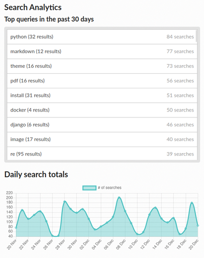
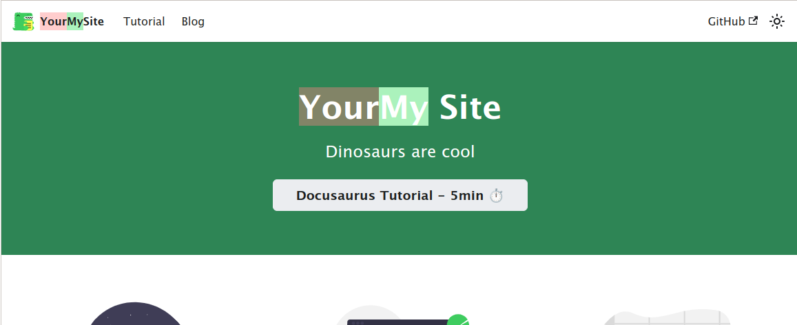
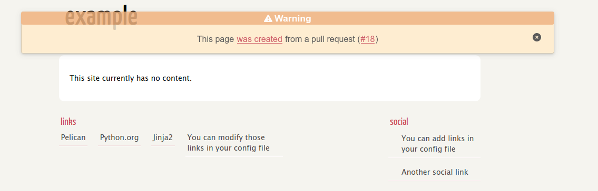
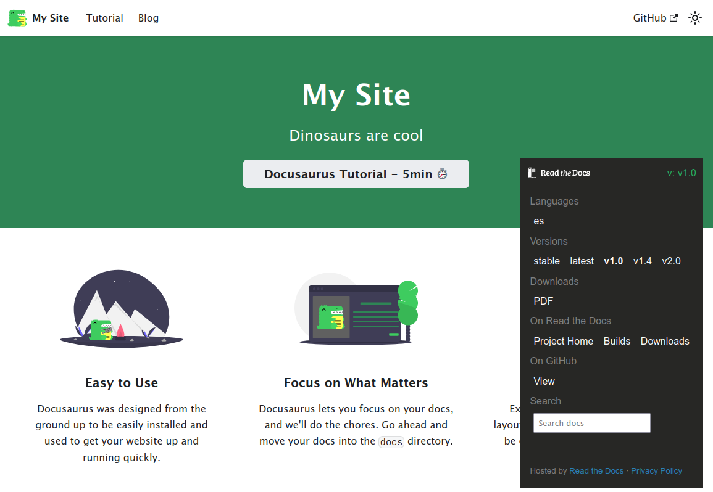
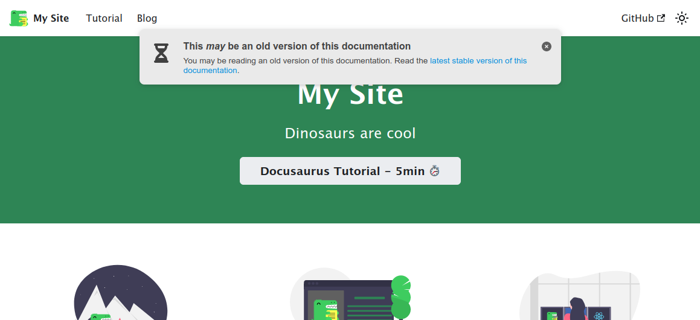
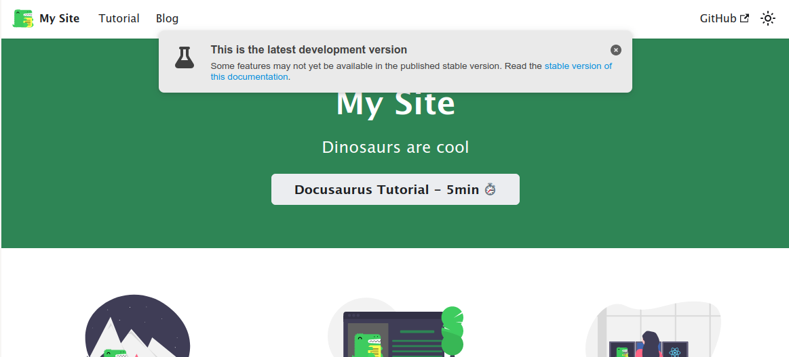
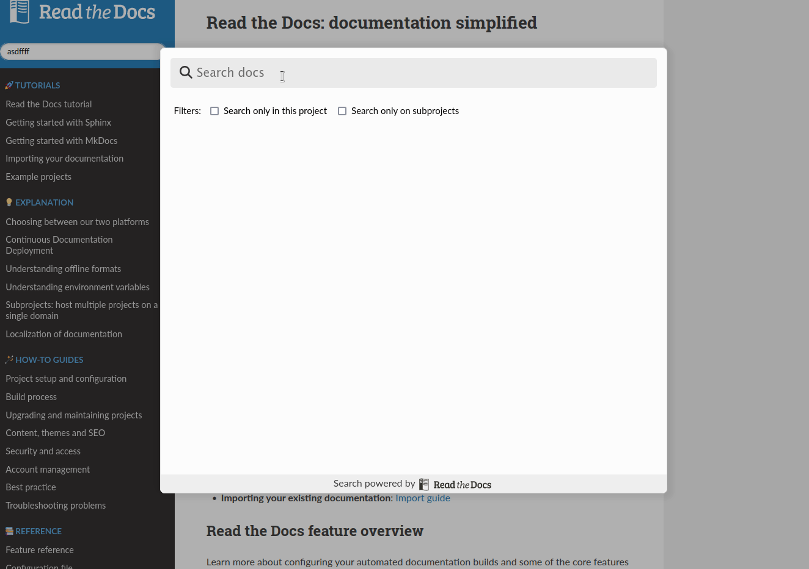
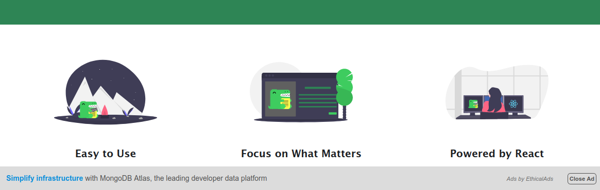

# Empower your docs with Read the Docs

This repository contains a self-contained JavaScript client that will empower your docs,
elevating them to the next level 🚀.
All these features are enabled by default _just_ by hosting your documentation in Read the Docs.

## Features

### Analytics

It uses the [Read the Docs analytics backend](https://docs.readthedocs.io/page/reference/analytics.html) to track page views and searches performed in your documentation.

| Traffic analytics                                                | Search analytics                                                               |
| ---------------------------------------------------------------- | ------------------------------------------------------------------------------ |
|          |                          |
| [Documentation](https://docs.readthedocs.io/page/analytics.html) | [Documentation](https://docs.readthedocs.io/page/guides/search-analytics.html) |

### Docdiff

Shows PR changes embeded on the documentation pages themselves.

### PR warning banner

Shows a banner at the top of the documentation communicating the build was performed from a Pull Request.

### Flyout

_Authentic_ Read the Docs' flyout that shows all the available versions,
links to download the offline formats, view and edit on GitHub and more.

### Non-stable version warning banner

Shows a banner at the top telling readers they may be reading an outdated version.

### Latest version warning banner

Shows a banner at the top telling readers they are reading the latest un-released version of the documentation.

### Search as you type

Super powered search as you type using the [Read the Docs's Server Side Search backend](https://docs.readthedocs.io/page/server-side-search/api.html),
powered by Elasticsearch.

### Sponsorship

[EthicalAds](https://www.ethicalads.io/) to support Read the Docs Community being free for everybody.

---

## Local Development

- Make sure you have the correct version of Node.js installed (>= 18). You can use [asdf](https://github.com/asdf-vm/asdf) or [nvm](https://github.com/nvm-sh/nvm) for easier management of different Node.js versions.
- Run `npm install` to install dependencies
- Run `npm run dev` to start the local dev server. While this can run without a local Read the Docs development instance, not everything will work.
- Run `npm test` to run the test suite, using web-test-runner. You can run also `npm run test:dev` to leave tests running in watch mode or `npm run test:debug` to manually test the suite in a browser.

## Deployment

Deploy documentation is available in our published docs here: https://readthedocs-addons.readthedocs.io/releasing.html

## Development guidelines

### Element attributes

- Don't use CSS classes on web component elements, these have tended to conflict with parent DOM styles. If needed, use CSS selectors against web component attributes like `:host[position="inline"]` instead.
- When adding an attribute on a custom web components, don't use `data` prefixed attributes, for example `<readthedocs-flyout position="inline">`.
- When using a custom attribute on a native element, do use `data` prefixed attributes, for example `
`.

### CSS variables

We use CSS variables to provide end users and theme maintainers with some light control of element styling of the inner shadow DOM elements.
Variables have several layers of prefixing/inheritance, as shown here using `font-size` as an example:

- `--readthedocs-font-size`: This can be set at `html`/`:root` in the parent DOM to affect font size on all of our elements.
- `--readthedocs-flyout-font-size`: This can be set at `html`/`:root` in the parent DOM to affect font size on only the flyout element.
- `--addons-flyout-font-size`: This is an inner variable used by the addon shadow DOM CSS. It's set inside each addon `:host` CSS selector to give a default value to `--readthedocs-flyout-font-size` without overriding a user supplied value for this variable.
